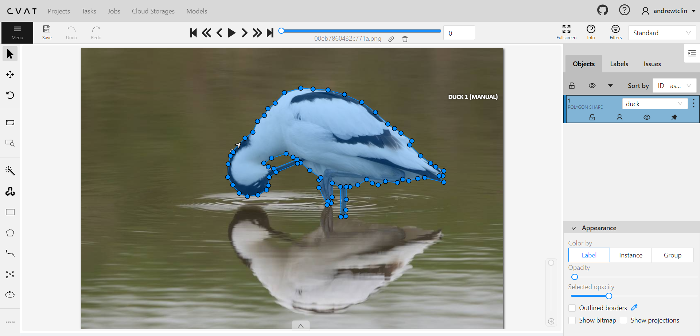
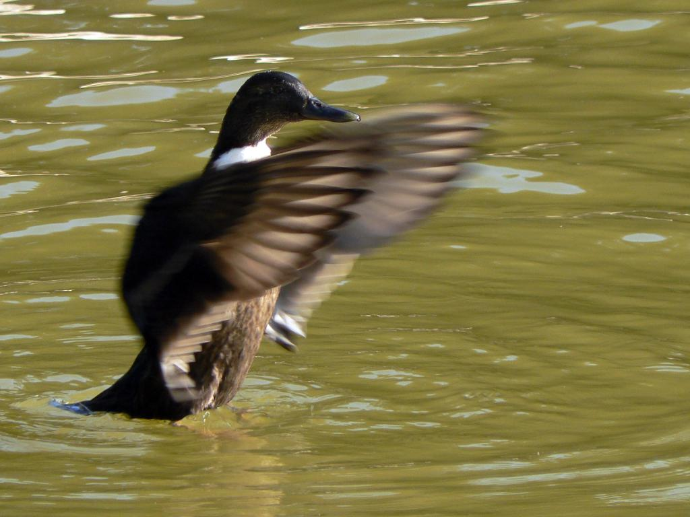
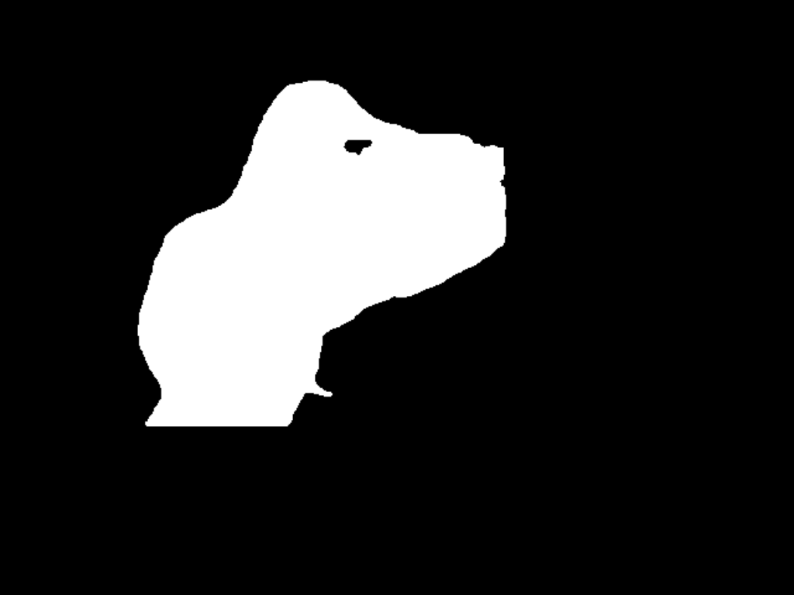

## Duck Segmentation - Running via YOLOv8

### Demo

- Demo showcasing duck segmentation:
  - [Duck Segmentation](https://github.com/andrewtclin/duck-segmentation-vision/blob/master/duck-segmentation.ipynb)

### Overview

- Duck Segmentation is a computer vision image segmentation that implements YOLOv8 and custom-trained image data to segment ducks from images.

- It goes from self-annotating to building a custom-trained model.

### Example prediction

- Original image

- Predicted mask

